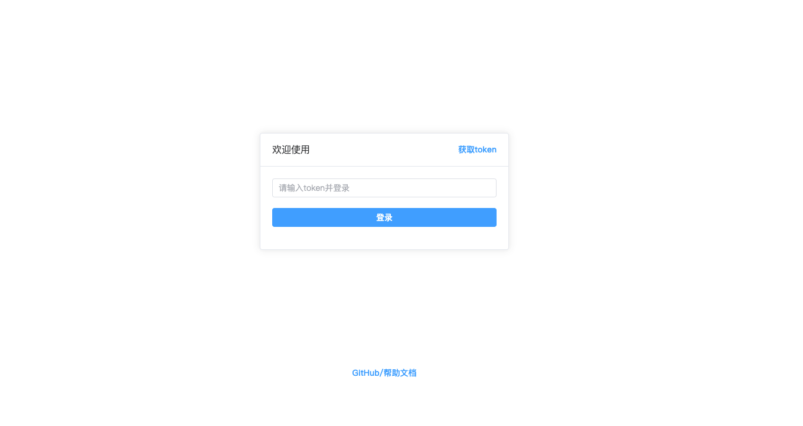
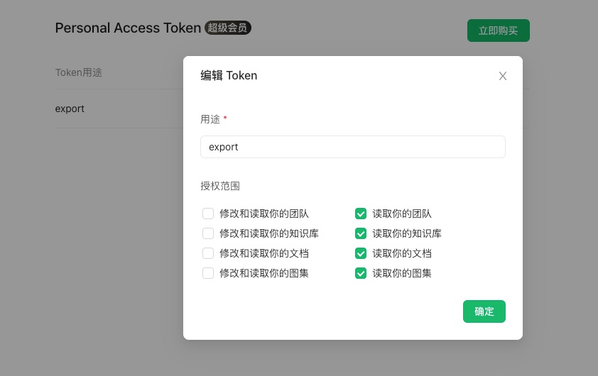
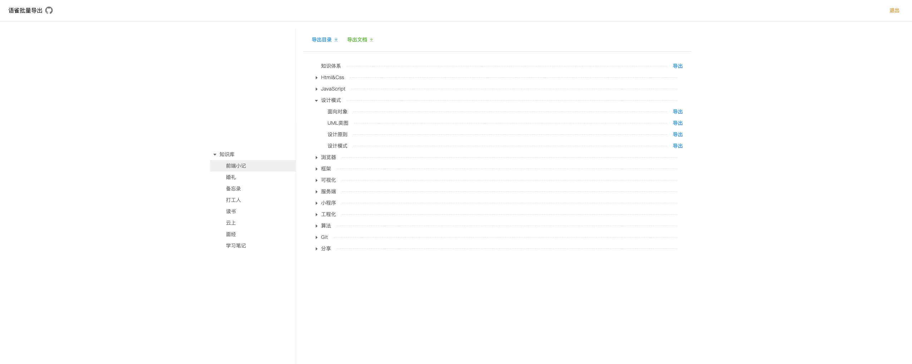
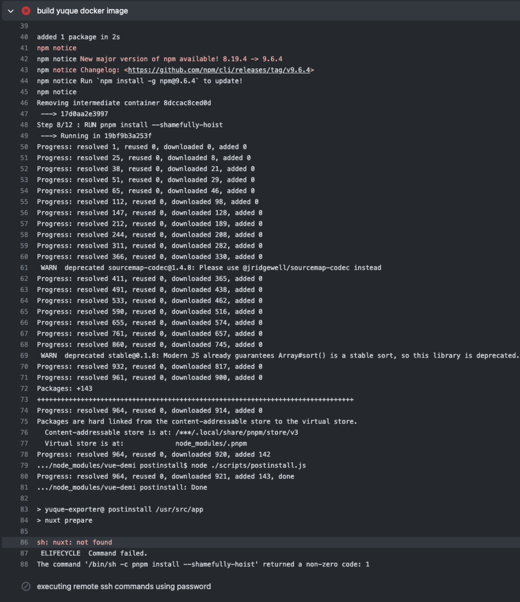
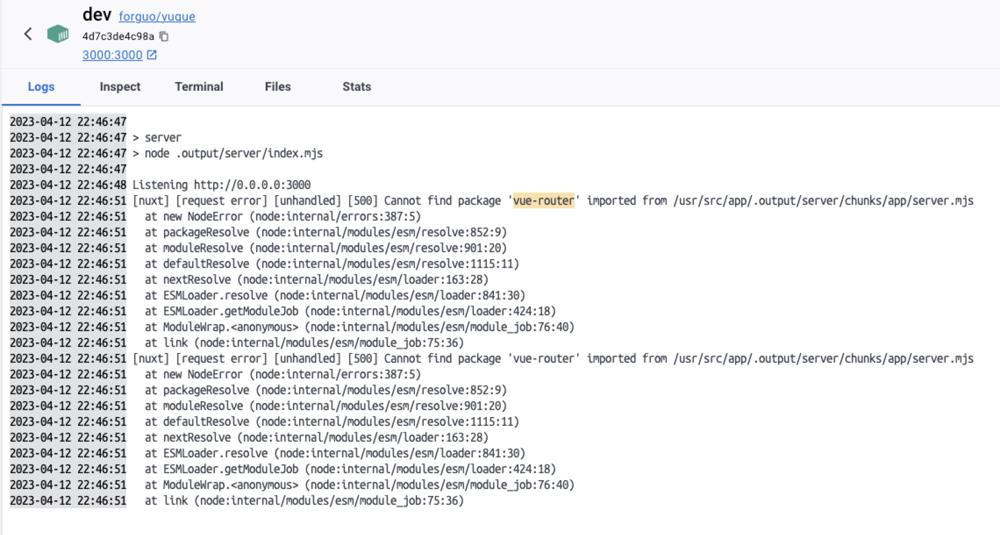

# yuque-exporter

> 语雀文档批量导出

[](https://github.com/wforguo/yuque-exporter/actions/workflows/docker-image-hub.yml)
[](http://commitizen.github.io/cz-cli/)

[快速访问](https://forguo.cn/yuque/)

[Github](https://github.com/wforguo/yuque-exporter)

[Blog](https://github.com/wforguo/forguo.cn)

## 项目由来

[语雀](https://www.yuque.com/)是一个不错的笔记与文档知识库，但是最近发现他开始割韭菜了，

知识库的公开开始收费，就想着把内容都导出自己来部署，发现并没有批量操作，amazing，不

过还好有 [api](https://www.yuque.com/yuque/developer/doc) ， 那就来造一个批量导出吧

## 技术栈

由于`CORS`，这里选了`nuxt3`，UI库使用 `element-plus`

[Nuxt 3](https://nuxt.com/docs/getting-started/introduction) + [element-plus](https://element-plus.org/zh-CN/)

## 功能

- 1、知识库目录导出`json`
- 2、知识库按文档结构导出所有文档【zip压缩包】
- 3、文档图片静态资源提取

## 使用

### 登录



你需要去获取语雀文档的 [token](https://www.yuque.com/yuque/developer/api#785a3731) ，在登录页面填入，完成登录即可使用

[token获取](https://www.yuque.com/yuque/developer/api#785a3731)



**勾选读权限即可，你的token只存储在浏览器storage当中**

### 导出



左侧对应语雀知识库列表

右侧对应选中的知识库文档树形结构

## 本地运行

### 安装依赖

```bash
# pnpm【推荐】
pnpm install
```

### 启动

server on [http://localhost:5001](http://localhost:5001)

```bash
pnpm run dev
```

## 语雀Api

[语雀Api](https://www.yuque.com/yuque/developer/doc)

列：获取知识列表

[https://www.yuque.com/api/v2/users/你的用户名/repos/](https://www.yuque.com/api/v2/users/forguo/repos/)

## nuxt3踩坑

### docker配置

#### 环境变量

```dockerfile
ENV NODE_ENV=production
ENV HOST 0.0.0.0
```

需要放置在`install`之后，因为nuxt在`npm install`时会进入`postinstall`，

执行`nuxt prepare`，此时如果`NODE_ENV=production`，此时`nuxt`大概率会去`.nuxt`找，这个时候并未生成，从而报错`nuxt: not found`

放在`build`之前, `install`之后即可



### docker打包

#### .output
  
`.output`不能添加在`.gitgnore`和`.dockergnore`中，
否则docker中不会打包，运行会出错，.output

#### .nuxt
  
`.nuxt`也不能添加在`.gitgnore`，否则`docker`打包会找不到路由等模块，只有`NuxtWelcome`组件

### 运行时报错

docker容器运行成功

打开浏览器报错


容器中报错

vue-router找不到



尝试了下，在`Dockerfile`中安装的`node_modules`不做删除，他就好了

最终完整的`Dockerfile`配置可参考项目

---

Thanks

[Github](https://github.com/wforguo/yuque-exporter)
